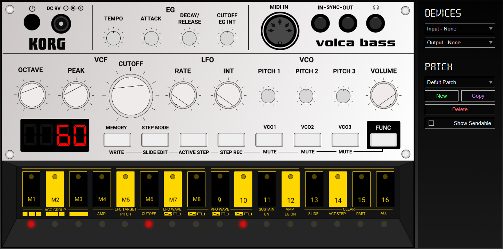

## Volca.CC
Volca.CC is a web-based patch editor for the Korg Volca Bass. To get any utility out of this app, you'll need to have a [Volca Bass](https://www.korg.com/us/products/dj/volca_bass/) and a MIDI-to-USB cable (or some kind of interface).

## Usage
Only a small subset of the editor's controls can actually be sent to the Volca Bass. This is because Korg's [midi implementation](http://i.korg.com/uploads/Support/USA_volcabass_MIDI_Chart_E.pdf) for the Volca series is sparse. You can still get quite a bit of variety out of the provided parameters, however. To highlight these parameters, toggle on the "Show Sendable" checkbox in the settings panel. 

The other controls can be used for reference, but are primarily there for the A E S T H E T I C.

### Browsers
Some browsers do not support the Web Midi API (looking at you Firefox). To use the editor with your Volca Bass I recommend Desktop Chrome. This app was designed for use on a Desktop browser and will probably not function correctly on a tablet. Hopefully, I can rectify this in the future.

### Settings Panel

***Devices:***
 - **Input Device** - The Volca Bass has no midi output, but you can use another midi controller as an input. All midi messages are routed to the output device. 
 - **Output Device** - This can be any midi output, however, the editor is designed to specifically control the Volca Bass.
 
 ***Patches:***
 - **Patch Select** - Select the active patch. Patches are automatically sent to the output when selected. You may need to reselect the current patch to send it when you change the active output device. 
 - **New** - Create a new patch w/ default values.
 - **Copy** - Create a duplicate of the currently selected patch.
 - **Delete** - Delete the currently selected patch.
 - **Show Sendable** - Toggles highlighting for controls which can be sent to the Volca Bass via midi (also see list below). 
 
 ### Editor
 
 ***Sendable Controls***
  - **Octave** - Changes the octave of the keyboard (both on the Volca Bass and the editor keyboard)
  - **Rate** - Sets the LFO speed
  - **Int** - Sets the LFO depth
  - **Pitch 1, 2, 3** - Sets the pitch for the respective oscillators to a range within one octave up or down
  - **Attack** - Sets the speed at which notes enter
  - **Decay / Release** - Sets speed at which notes fade/fall
  - **Cutoff Eg Int** - Sets intensity of where the VCG cutoff is changed according to the EG (straight from the docs, I dunno either)

  For more info check out the [user manual](http://i.korg.com/uploads/Support/USA_volca_bass_OM_EFGSC2.pdf). Godspeed.
  
## Development
2024 Note: I created this for fun many years ago. The project is extremely outdated and was created using a very old version of create-react-app, but I've gone to the trouble of getting a build to be hosted on Github Pages. It still works quite well and, honestly, is way cooler than I remembered!